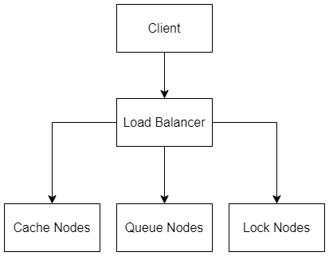

# Overview  
**Nama:** Dimas Ramadhani  
**NIM:** 11231021  
**Mata Kuliah:** Sistem Paralel dan Terdistribusi  
**Kelas:** A  
**Link Video Demonstrasi:** https://youtu.be/W07fxILfQAE

---

# Deskripsi Singkat  
**Distributed Sync System** merupakan sistem terdistribusi yang dibangun menggunakan **Raft Consensus Algorithm** sebagai fondasi koordinasi antar node. Sistem ini terdiri dari tiga jenis layanan utama:

1. **Lock Node (Port 800x)** → Pengelola kunci terdistribusi berbasis Raft.  
2. **Queue Node (Port 810x)** → Antrian pesan (Message Queue) dengan mekanisme **ACK (acknowledgment)** untuk memastikan pengiriman.  
3. **Cache Node (Port 820x)** → Sistem cache terdistribusi dengan **protokol MESI (Modified, Exclusive, Shared, Invalid)** untuk menjaga konsistensi data antar node.

Ketiga node ini berkomunikasi dan menjaga konsistensi melalui proses **leader election**, **replication**, serta **heartbeat**, sehingga sistem mampu menghadapi kegagalan node tanpa kehilangan data.

---

# Arsitektur Sistem  


Semua node dibangun di atas modul inti **RaftNode**, yang menangani:
- Pemilihan pemimpin (Leader Election)  
- Replikasi log antar node  
- Pengiriman heartbeat  
- Pengelolaan *AppendEntries* dan *RequestVote*  
- Komitmen log serta penerapan state machine  

---

# Instalasi & Menjalankan Sistem

## 1. Masuk ke Folder Docker
```bash
cd docker
```

## 2.0 Build & Run
```bash
docker compose up --build
```

## 2.1 Cek logs:
```bash
docker compose logs -f
```

## 2.2 Reset:
```bash
docker compose down -v
```

# Pengujian dan Demonstrasi
## Cek Health dan Leader
### Lock Cluster
```bash
curl http://localhost:8000/health \
curl http://localhost:8001/health \
curl http://localhost:8002/health
```

### Queue Cluster
```bash
curl http://localhost:8100/health \
curl http://localhost:8101/health \
curl http://localhost:8102/health
```

### Cache Cluser
```bash
curl http://localhost:8200/health \
curl http://localhost:8201/health \
curl http://localhost:8202/health
```

# Endpoint dan Contoh Request
## Acquire Lock
```powershell
$body = '{"key":"A","mode":"X","client_id":"client1"}'
Invoke-WebRequest -Uri "http://localhost:8000/lock/acquire" -Method POST -ContentType "application/json" -Body $body
```

## Release Lock
```powershell
$body = '{"key":"A","client_id":"client1"}'
Invoke-WebRequest -Uri "http://localhost:8000/lock/release" -Method POST -ContentType "application/json" -Body $body
```

## Enqueue
```powershell
$body = '{"key":"user:42","value":"hello"}'
Invoke-WebRequest -Uri "http://localhost:8100/queue/enq" -Method POST -ContentType "application/json" -Body $body
```

## Dequeue
```powershell
Invoke-WebRequest -Uri "http://localhost:8100/queue/deq" -Method POST
```
## Ack Message
```powershell
$ack = '{"msg_id":"1761617481398441049"}' 
Invoke-WebRequest -Uri "http://localhost:8100/queue/ack" -Method POST -ContentType "application/json" -Body $ack
```

## PUT Data

```powershell
$body = @'
{"key":"user:42","val":{"name":"Arya","score":99}}
'@
Invoke-WebRequest -Uri "http://localhost:8200/cache/put" -Method POST -ContentType "application/json" -Body $body
```

## GET Data
```powershell
$body = @'
{"key":"user:42"}
'@
Invoke-WebRequest -Uri "http://localhost:8200/cache/get" -Method POST -ContentType "application/json" -Body $body
```

## Metrics Monitoring
Masing-masing node menyediakan endpoint **Prometheus Metrics**:
- Lock Node: http://localhost:8002/metrics
- Queue Node: http://localhost:8102/metrics
- Cache Node: http://localhost:8200/metrics
